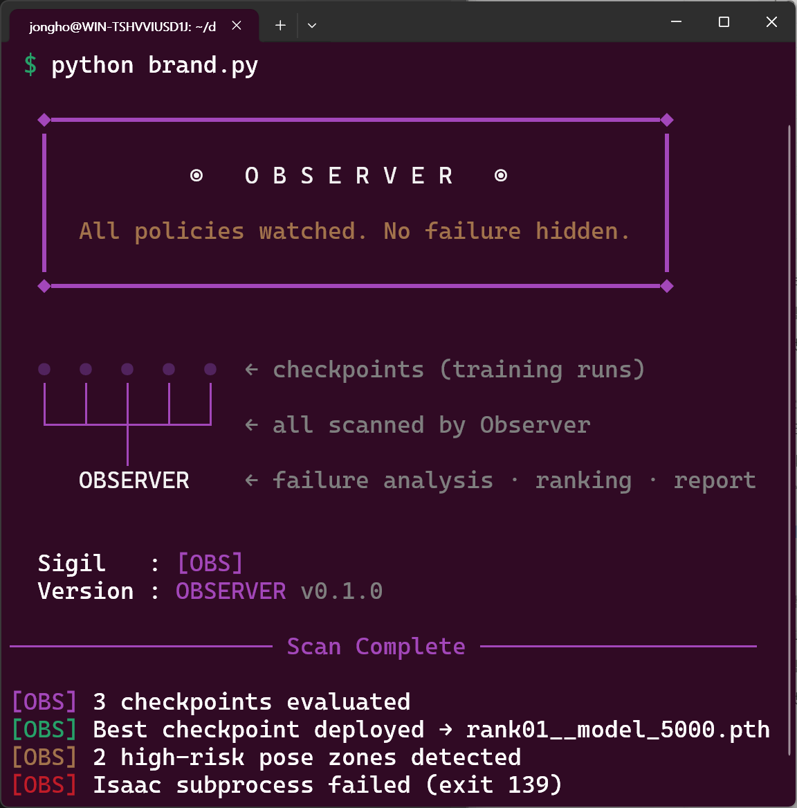

<div align="center">

# 👁️ OBSERVER · Automated Evaluation Pipeline



**Stop watching videos. Start reading data.**

*Automated checkpoint evaluation · Multi-view recording · Failure diagnosis · Experiment tracking*

---

[](https://python.org)
[](https://isaac-sim.github.io/IsaacLab/)
[](https://wandb.ai)
[](LICENSE)

📖 팀 온보딩 한글 문서: [`docs/INTRO_KO.md`](docs/INTRO_KO.md)

</div>

---

## 🧠 Why This Exists

### The Evaluation Bottleneck Is Real

Dexterous manipulation research generates checkpoints faster than any human can meaningfully evaluate them.
The failure mode isn't training — it's **analysis at scale**.

Here are scenarios that happen all the time:

---

🔬 **Scenario A — The Ablation Study**
> You're running a reward shaping ablation: contact force weight × 4 conditions, slip penalty × 3 levels, curriculum schedule × 2 variants.
> That's 24 configurations. Each produces checkpoints at 1k, 3k, 5k, 10k steps.
> **96 checkpoints.** You have one afternoon.

---

🎲 **Scenario B — The Seed Sensitivity Check**
> Your policy looks great — but is it reproducible?
> You retrain with 10 different random seeds to characterize variance.
> Each seed produces a full checkpoint history.
> Manually comparing convergence behavior across 10 runs is **cognitively impossible**.

---

🔁 **Scenario C — The Iterative Reward Design Loop**
> You tweak the reward function, retrain overnight, watch a few episodes in Isaac, feel uncertain,
> tweak again, repeat. After a week, you've accumulated 30+ checkpoints from 8 reward variants.
> **Which reward actually worked, and why?** You've lost the thread.

---

🧪 **Scenario D — The Architecture Search**
> Policy network depth × 3, latent dimension × 4, with and without tactile observation.
> You train each configuration to convergence.
> The question isn't just "what succeeded" — it's **"what failed, and where in pose space."**
> Manual viewport inspection cannot answer that.

---

### 📉 What Manual Review Actually Gives You

Every engineer who has sat through 20+ Isaac playback sessions knows this feeling:

| ❓ What you need to know | 😶 What manual review gives you |
|:---|:---|
| Is this policy statistically better? | *"It looked smoother today"* |
| Where in pose space does it fail? | *"It dropped the cube once"* |
| Is fingertip contact stable over time? | *"Seemed okay"* |
| Which of these 30 checkpoints is actually best? | *Whichever one you watched last* |
| Did the slip rate improve vs. last run? | *"Hard to say"* |

> 🧠 **The three invisible biases of manual evaluation:**
>
> - **Selection bias** — you tend to watch the runs you already expect to be good
> - **Recency bias** — run #30 gets remembered more vividly than run #3
> - **Observer fatigue** — your 20th review session is never as sharp as your first

---

### ⚠️ Why Dexterous Manipulation Is Especially Unforgiving

High-DOF dexterous hand control has failure modes that are **completely invisible to scalar success rate**:

```
success_rate = 0.91   ← looks great on paper
```

But underneath that number:

| 🚨 Hidden problem | 📊 What success rate shows | 💥 Real-world consequence |
|:---|:---|:---|
| 3 slip events per episode | Nothing | Fingertip actuator wear within hours |
| Policy only works for roll ∈ [−20°, 20°] | Nothing | Brittle generalization — memorization, not learning |
| Joint velocity spikes near singularities | Nothing | Hardware safety hazard on real robot |
| Energy consumption 5× higher than baseline | Nothing | Battery drain, thermal overload |

> 💡 **The critical insight:** A policy that *looks* good in a 30-second viewport session
> may be actively dangerous when deployed on physical hardware.
> The only way to catch these issues is **systematic, quantitative analysis across many episodes.**

---

## ✅ What This Pipeline Does

**One command. Everything automated.**

```bash
python eval_runner.py --checkpoint_dir runs/ --recursive \
    --auto_select --select_weights hardware_safe
```

### ⚙️ Automated Steps

| # | 🔧 Step | 📤 Output |
|:---:|:---|:---|
| 1 | 📦 **Metrics collection** | `metrics.json` — 8 quantitative indicators per checkpoint |
| 2 | 🔍 **Failure mode classification** | 7-class rule-based taxonomy, zero Isaac dependency |
| 3 | 🗺️ **State coverage analysis** | Success heatmap over roll × pitch pose space |
| 4 | 🎬 **Multi-view video recording** | 5 camera angles + 2×3 grid composite mp4 |
| 5 | 📡 **Experiment tracking** | W&B / TensorBoard real-time logging |
| 6 | 🏆 **Multi-objective ranking** | Weighted score: success rate, slip, energy, pose error |
| 7 | 📄 **HTML report** | Self-contained report with charts, pies, videos, and heatmaps |

---

## 📐 Architecture

```
eval_runner.py
    │
    ├── 📡 ExperimentTracker    W&B + TensorBoard (auto-detected)
    │
    ├── 🔄 PipelineOrchestrator (per checkpoint)
    │     ├── [1] 📦 MetricsCollector        → metrics.json
    │     ├── [2] 🔍 FailureModeClassifier   → failure distribution
    │     ├── [3] 🗺️ StateCoverageAnalyzer   → PNG heatmaps
    │     ├── [4] 🎬 CameraController        → viewport sweep
    │     └── [5] 📡 ExperimentTracker       → logging
    │
    ├── 🏆 CheckpointSelector   Multi-objective scoring + deploy
    │
    └── 📄 ReportGenerator      eval_report.html
```

### 🗂️ File Map

```
observer/
├── 🚀 eval_runner.py              Entry point (exposed as `observer` CLI)
├── 🎨 brand.py                    Console branding / banner styling
├── 📦 requirements.txt            Core runtime dependencies
├── 🏗️ setup.py                    Package install script
├── configs/
│   ├── 📝 eval_config.py          Configuration dataclass
│   └── ⚙️ eval_config.yaml        ← Edit this per experiment
├── pipeline/
│   ├── 🔄 orchestrator.py         Per-checkpoint cycle coordinator
│   ├── 📦 metrics_collector.py    Per-step metric accumulator
│   ├── 🔍 failure_classifier.py   Rule-based failure mode taxonomy
│   ├── 🗺️ state_coverage.py       Initial pose coverage analysis
│   ├── 📡 experiment_tracker.py   W&B / TensorBoard integration
│   └── 🏆 auto_select.py          Multi-objective checkpoint scoring
├── isaac/
│   ├── 🎥 camera_controller.py    Isaac Sim viewport control
│   └── 🎬 recorder.py             Replicator-based video capture
├── report/
│   └── 📄 report_generator.py     HTML report generator
└── tactile/
    └── 👆 overlay.py              Deform map video overlay
```

---

## 🚀 Quick Start

> **First time on this repo?** Run `./scripts/setup.sh` to install observer
> and check prerequisites, then `observer doctor` to validate your config.
> Common workflows are wrapped in `make help` — `make best DIR=runs/` is
> the typical one-shot.

### 1️⃣ Point observer at your RL stack

Observer is framework-agnostic. It launches **your** eval and (optional)
record scripts as subprocesses and only requires that they satisfy the
contract in [`docs/INTEGRATION.md`](docs/INTEGRATION.md).

```yaml
# configs/eval_config.yaml
runtime:
  task: "<your-task-id>"
  eval_module: "your_pkg.scripts.eval"       # python -m <eval_module>
  record_script: "your_pkg/scripts/record.py"  # isaaclab.sh -p <record_script>
  isaac_lab_path: "${ISAACLAB_PATH}/isaaclab.sh"
```

Ready-made adapter stanzas live under [`docs/adapters/`](docs/adapters/).
A sharpa-rl-lab integration is documented in
[`docs/adapters/sharpa.md`](docs/adapters/sharpa.md).

### 2️⃣ Policy loading

Observer never instantiates your actor directly. Your eval script is
responsible for restoring the checkpoint, applying any observation
normalization, and running inference — then emitting `metrics.json` and
`episodes.json` per the contract.

### 3️⃣ Run

```bash
# 🔹 Single checkpoint
python eval_runner.py --checkpoint runs/exp_001/model_5000.pth

# 🔹 Full directory sweep
python eval_runner.py --checkpoint_dir runs/exp_001/

# 🔹 Recursive across all experiments, latest checkpoint only
python eval_runner.py --checkpoint_dir runs/ --recursive --latest_only

# 🔹 Hardware-safe ranking + deploy top-2
python eval_runner.py --checkpoint_dir runs/ \
    --auto_select --select_weights hardware_safe --deploy_top_k 2

# 🔹 Metrics only, no video, with W&B logging
python eval_runner.py --checkpoint_dir runs/ \
    --skip_video --wandb_project my-project

# 🔹 Dry run — validate pipeline without launching Isaac
python eval_runner.py --checkpoint_dir runs/ --dry_run
```

---

## 📊 Collected Metrics

| 📏 Metric | 📐 Unit | 💬 Interpretation |
|:---|:---:|:---|
| `success_rate` | % | Episode success rate |
| `contact_force_rms` | N | Fingertip RMS force — lower = more stable grasp |
| `joint_velocity_rms` | rad/s | Jerk proxy — spikes indicate control instability |
| `slip_events_per_episode` | count | Tactile slip count — critical for hardware safety |
| `mean_episode_length` | steps | Shorter episodes may indicate early failure |
| `object_pos_error_mm` | mm | Final position deviation from goal |
| `object_rot_error_deg` | deg | Final rotation deviation from goal |
| `energy_J` | J | Joint torque × velocity integral — efficiency proxy |

---

## 🔍 Failure Mode Taxonomy

Classified per episode via a **priority-ordered rule chain** — no training data required, works from checkpoint zero:

| 🏷️ Mode | 📋 Rule | ⚡ Hardware Implication |
|:---|:---|:---|
| `💥 early_drop` | Episode length < 50 steps | Grasp initiation failure |
| `⚡ singularity_hit` | Max joint velocity > 5 rad/s | Actuator overload risk |
| `🌀 late_slip` | Slip event count ≥ 3 | Progressive grasp degradation |
| `👆 contact_loss` | Tail-window mean force < 0.01 N | Loss of fingertip engagement |
| `🎯 repose_failure` | Final pose error > threshold | Task-level failure despite stable grasp |
| `⏱️ timeout` | Max steps, no other rule matched | Policy too slow or trapped |

> 💡 **Actionable insight example:** If 60% of failures are classified as `late_slip`,
> the fix is to increase the slip penalty weight in your reward function —
> not to tune the grasp initialization curriculum.
> The classifier tells you *what to fix*, not just *that something is broken*.

---

## 🏆 Multi-Objective Checkpoint Ranking

Success rate alone is a **misleading selection criterion** for dexterous manipulation.
The `CheckpointSelector` computes a weighted multi-objective score:

$$\text{Score} = w_{sr} \cdot \text{SR}_{\text{norm}} - w_{\text{slip}} \cdot \text{slip}_{\text{norm}} - w_{\text{energy}} \cdot E_{\text{norm}} - w_{\text{pos}} \cdot \text{pos\_err}_{\text{norm}}$$

Three built-in presets:

| 🎛️ Preset | 🎯 Best For |
|:---|:---|
| `balanced` | General-purpose evaluation and comparison |
| `hardware_safe` | Pre-deployment selection — penalizes slip and energy heavily |
| `performance_first` | Ablation studies — prioritizes raw task success rate |

```bash
python eval_runner.py --checkpoint_dir runs/ \
    --auto_select --select_weights hardware_safe
```

Deployed checkpoints land here:

```
📁 eval_results/best/
  ├── 🥇 rank01__model_6000.pth  →  (symlink to original)
  ├── 🥈 rank02__model_4000.pth
  └── 📋 selection_meta.json
```

---

## 🗺️ State Coverage Analysis

> 💬 *"A policy with 90% success rate that only works for 30% of the initial pose space
> is not a good policy — it's a brittle one."*

The `StateCoverageAnalyzer` bins episodes by initial object pose and reveals **where** the policy breaks down:

| 🖼️ Output | 📋 Description | 🎯 Use |
|:---|:---|:---|
| `success_heatmap.png` | 2D success rate over roll × pitch bins | Identify high-risk pose zones |
| `coverage_scatter.png` | Per-episode scatter colored by failure mode | Visualize failure clustering |
| `pose_histogram.png` | Roll / pitch / yaw sampling distribution | Verify curriculum coverage |
| `coverage_stats.json` | Worst zone coords + uniformity score | Feed into next curriculum design |

🔴 **Red zones in the heatmap = next curriculum targets.**
If failures concentrate in roll ∈ [30°, 60°], sample that region more heavily in the next training run.

---

## 📹 Output Structure

```
📁 eval_results/
├── 📄 eval_report.html                         ← Open in browser
├── 🏆 best/
│   ├── 🥇 rank01__model_6000.pth
│   └── 📋 selection_meta.json
└── 📁 exp_001__model_5000__20240117_143022/
    ├── ⚙️  eval_config_snapshot.yaml           Reproducibility record
    ├── 📊 metrics.json
    ├── 📝 episodes.json                        Per-episode data (if available)
    ├── 📷 camera_poses.json
    ├── 📁 coverage/
    │   ├── 🌡️ success_heatmap.png
    │   ├── 🔵 coverage_scatter.png
    │   └── 📊 pose_histogram.png
    └── 📁 videos/
        ├── 🎬 front.mp4
        ├── 🎬 side.mp4
        ├── 🎬 top.mp4
        └── 🎬 combined_grid.mp4                All views in one file
```

---

## 🛠️ Dependencies

```bash
# 🔧 Core
pip install numpy pyyaml matplotlib

# 🎞️ Video processing (system package)
sudo apt install ffmpeg

# 📡 Experiment tracking (optional — install either or both)
pip install wandb
pip install tensorboard

# 👆 Tactile overlay (optional)
pip install opencv-python

# 🤖 Isaac environment (provided by Isaac Lab installation)
# omni.isaac.lab  ·  omni.replicator.core  ·  omni.kit.viewport.utility
```

---

## ⚠️ Notes & Gotchas

**🖥️ Headless server video recording**
Isaac Sim GUI requires an active display. Use Xvfb for headless servers:
```bash
Xvfb :99 -screen 0 1920x1080x24 &
DISPLAY=:99 python eval_runner.py --checkpoint_dir runs/
```

**🔑 Policy loading**
Observer never instantiates the actor. Your eval script
(`runtime.eval_module`) is responsible for checkpoint loading, observation
normalization, and inference. See `docs/INTEGRATION.md` §1.

**📝 Episode-level data**
`StateCoverageAnalyzer` and `FailureModeClassifier` consume `episodes.json`
emitted by your eval script. The schema is documented in
`docs/INTEGRATION.md` §1 and matches
`observer.pipeline.metrics_collector.EpisodeStats`.

---

<div align="center">

*Built for high-DOF dexterous manipulation · Isaac Lab / Isaac Sim · GPU-parallel RL*

</div>
